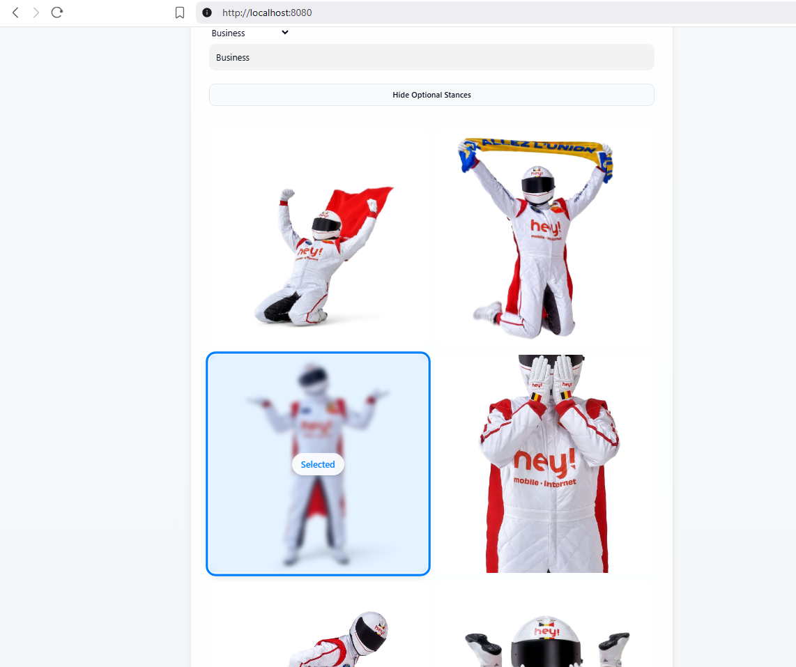

# Welcome to Hey! campaign creator
This project was originally created as demo for during the Hey! hackathon in 2025.
But it was later extended to connect to an actual fine tuned image gen model.

# Hosting the web app:
This will only work with a valid replicate token set in the backend!
**For security reasons the hardcoded replicate token is currently disabled.**

```sh
# Make sure you have npm and that you are in root of project
# Install the necessary dependencies
npm i

# Start frontend in dev
npm run dev

# Make sure you have python
# Install requirements (recommended to do in virtual environment)
pip install -r requirements.txt

# Run the backend
python back.py
```

# How it looks:
## Form page
Here you can fill out the form for your desired campaign


Optionally the stance can be chosen by using the selector


## Feedback page


## Some results from the used model
https://docs.google.com/document/d/1guQX7zPvMgS_qlnUV6Ve2pz3v15Rg6Osl1CpXYC4cbM/edit?tab=t.0

# How it works:
The frontend provides a form to setup queries which are sent to our backend.
The backend transforms input queries into a prompt for the flux api where we host our finetuned flux model.
We wait for generated images from flux api, once they are downloaded we put them in the uploads folder.
Once backend returns ok status code, the frontend will look for the images in this folder.
Feedback form allows user to ask the flux model to improve a given image.
Until user is statisfied we reload feedback form, at the bottom there is a download button for the selected image.

# Training of the model:
Trainingdata folder contains stance images and background images.
With the combine.py script you can combine the masks onto the backgrounds to create a training set per stance.
make_captions.py uses hardcoded dictionary to build caption files.
train_api.py is a way to start a replicate training in python.

Required libraries:
- pillow (for combine.py)
- replicate (for train_api.py)